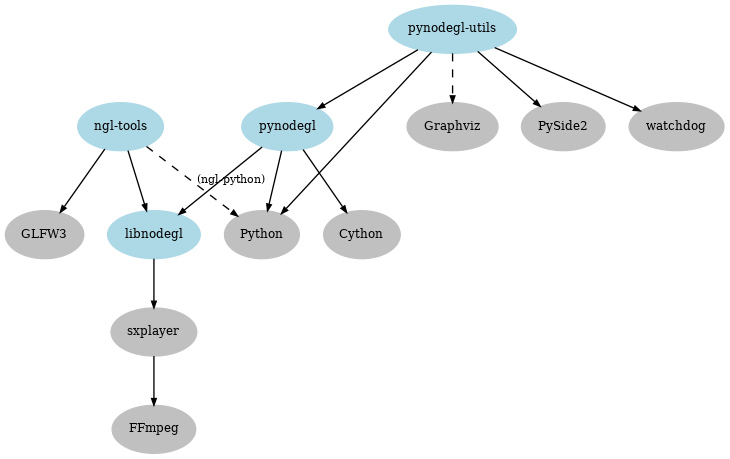

Project architecture and organization
=====================================

The `node.gl` project is split in several parts:

- `libnodegl`: the core of the project, an `OpenGL` engine in `C`, containing
  all the nodes.
- `ngl-tools`: a set of various program tools using `libnodegl`.
- `pynodegl`: a Python binding for `libnodegl` (with the help of `Cython`) to
  create graph scenes in the most simple way.
- `pynodegl-utils`: various Python utilities and examples such as an advanced
  Qt5 viewer with many features such as live editing.

## Dependencies

- `libnodegl` requires a standard C toolchain (C compiler, linker, GNU/Make).
  It also depends on [sxplayer library][sxplayer] for media (video and images)
  playback. [Graphviz][graphviz] is optional but can be used to render and
  preview graphs obtained from the API.
- `ngl-tools` needs [GLFW3][glfw3] and `libnodegl` installed.
- `pynodegl` needs [Python][python] and [Cython][cython], and `libnodegl`
  installed.
- `pynodegl-utils` needs [Python][python] and `pynodegl`. The viewer depends on
  `PySide2` (which is the main reason why this package is separated from the
  `pynodegl` package). It is also recommended to install [Graphviz][graphviz]
  in order to render graph in the viewer.

[sxplayer]: https://github.com/stupeflix/sxplayer
[graphviz]: http://www.graphviz.org/
[python]: https://www.python.org/
[cython]: http://cython.org/
[glfw3]: http://www.glfw.org/
